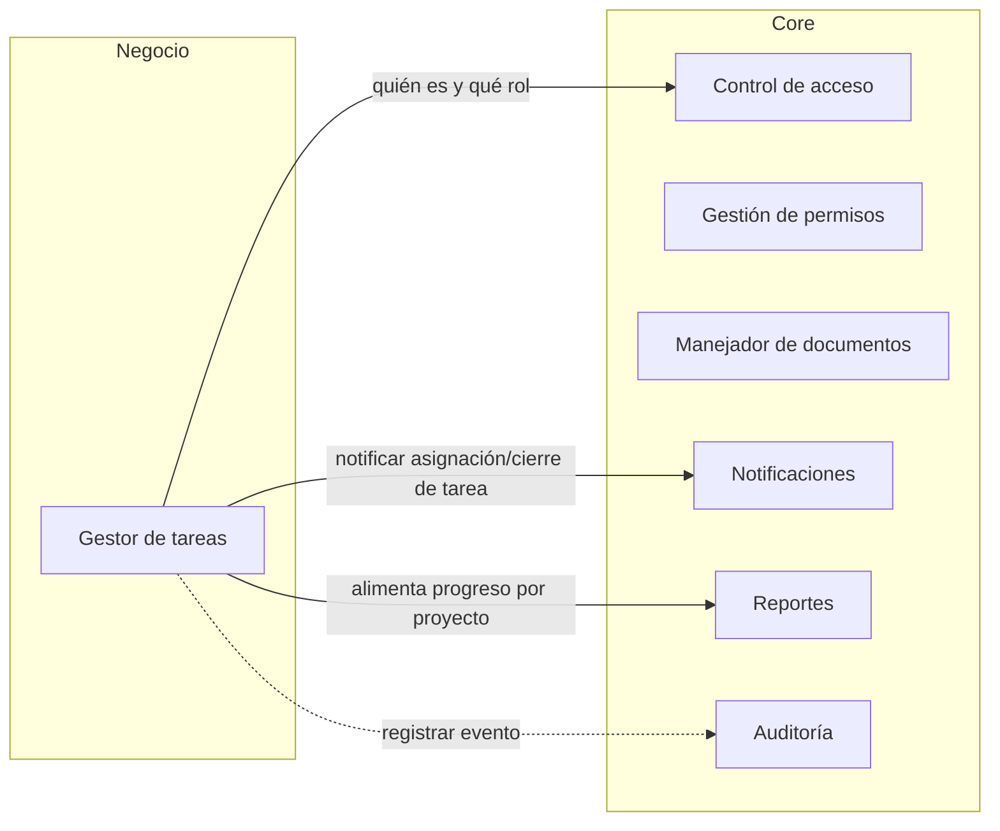
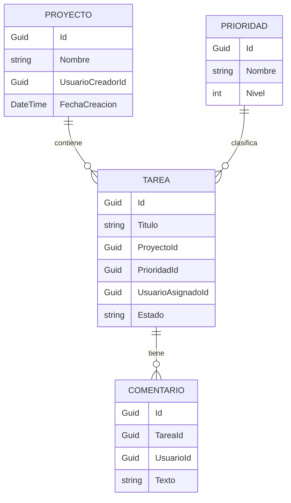

# GestorTareasP3
Proyecto de Programación III

## Arquitectura de componentes

```mermaid
flowchart LR
  subgraph Core
    ACC[Control de acceso]
    PERM[Gestión de permisos]
    DOC[Manejador de documentos]
    NOTI[Notificaciones]
    REP[Reportes]
    AUD[Auditoría]
  end
  subgraph Negocio
    GT[Gestor de tareas]
  end
  GT -->|quién es y qué rol| ACC
  GT -->|notificar asignación/cierre de tarea| NOTI
  GT -->|alimenta progreso por proyecto| REP
  GT -.->|registrar evento| AUD
```

## Entidades del módulo de negocio

```mermaid
erDiagram
    PROYECTO ||--o{ TAREA : contiene
    PRIORIDAD ||--o{ TAREA : clasifica
    TAREA ||--o{ COMENTARIO : tiene
    PROYECTO {
        Guid Id
        string Nombre
        Guid UsuarioCreadorId
        DateTime FechaCreacion
    }
    TAREA {
        Guid Id
        string Titulo
        Guid ProyectoId
        Guid PrioridadId
        Guid UsuarioAsignadoId
        string Estado
    }
    PRIORIDAD {
        Guid Id
        string Nombre
        int Nivel
    }
    COMENTARIO {
        Guid Id
        Guid TareaId
        Guid UsuarioId
        string Texto
    }
```
