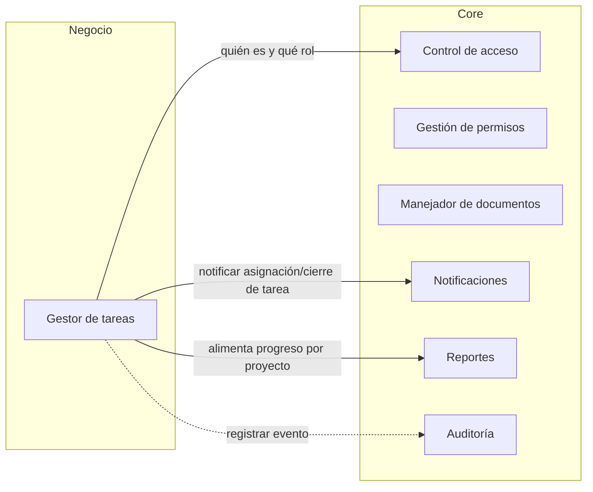
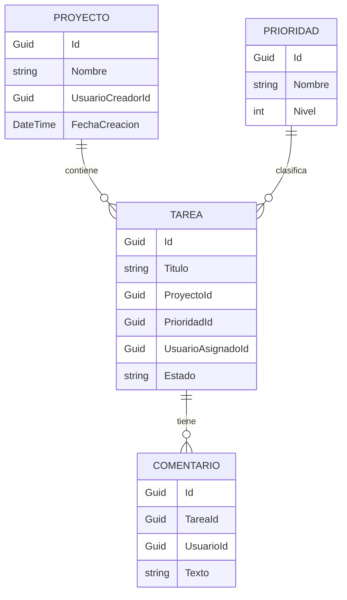

# GestorTareasP3
Proyecto de Programación III — fogueo: combina versión A y versión B
## Arquitectura de componentes



## Entidades del módulo de negocio



## Cómo ejecutar

### Prerrequisitos
- SDK de .NET instalado.

### Comandos de ejecución
Desde la raíz del repositorio, ejecuta los siguientes comandos en este orden:

```bash
dotnet restore
dotnet build
dotnet run --project src/GestorTareas.Api --launch-profile http
```

### Probar endpoint de salud
En otra terminal, prueba el endpoint `GET http://localhost:5065/salud`:

En PowerShell:
```powershell
Invoke-RestMethod http://localhost:5065/salud
```
*(o alternativamente `curl.exe http://localhost:5065/salud`, dado que `curl` a secas es un alias distinto en PowerShell)*

Salida esperada:
```text
OK
```

## Variables de entorno

| Nombre | Para qué sirve |
| --- | --- |
| *(Ninguna)* | Por ahora no se requiere ninguna variable de entorno. |

> **Nota:** Las variables de entorno se irán documentando aquí a medida que el código las use. Nunca se deben registrar valores.
