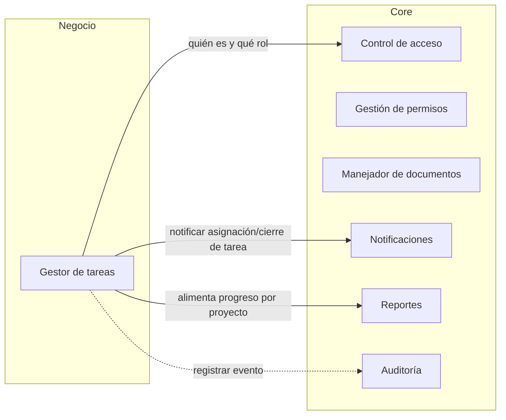
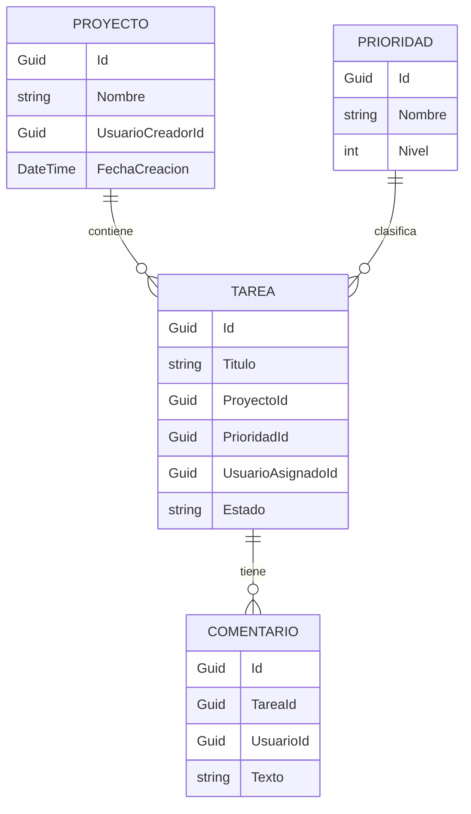

# GestorTareasP3
Gestor de tareas por proyecto: organiza las tareas por proyecto y prioridad, con vista de progreso. Proyecto de Programación III.
## Arquitectura de componentes



## Entidades del módulo de negocio



## Cómo ejecutar

### Requisitos previos
- SDK de .NET 10.
- Docker Desktop, abierto y corriendo.
- Herramienta de migraciones de Entity Framework: `dotnet tool install --global dotnet-ef` (una sola vez).
- PowerShell (los comandos de este README son para Windows PowerShell).

### 1. Variables de entorno
Copia la plantilla y completa tus valores:

```powershell
Copy-Item .env.example .env
```

Abre `.env` y define:
- `MSSQL_SA_PASSWORD`: inventa una contraseña de 8 o más caracteres con mayúscula, minúscula, número y símbolo. Evita `$`, `;`, `=`, comillas y espacios.
- `ConnectionStrings__Default`: reemplaza `CAMBIAR_ESTO` en `Database` por `GestorTareas` y en `Password` por la misma contraseña de arriba.
- `SMTP_USUARIO` y `SMTP_REMITENTE`: tu cuenta de Gmail.
- `SMTP_CLAVE`: la contraseña de aplicación de esa cuenta, sin espacios.
- `SMTP_HOST`, `SMTP_PUERTO` y `SMTP_NOMBRE_REMITENTE` ya traen un valor útil en la plantilla.
- `APP_URL_BASE`: ya trae `http://localhost:5065` en la plantilla; cámbiala solo si usas otro puerto.

El archivo `.env` está en `.gitignore` y nunca se sube al repositorio.

| Nombre | Para qué sirve |
| --- | --- |
| `MSSQL_SA_PASSWORD` | Contraseña del usuario `sa` del SQL Server en Docker. La lee Docker Compose desde `.env`. |
| `ConnectionStrings__Default` | Cadena de conexión a la base `GestorTareas`. La usan la API y `dotnet ef`. |
| `SMTP_HOST` | Servidor SMTP. Con Gmail: `smtp.gmail.com`. |
| `SMTP_PUERTO` | Puerto SMTP con cifrado STARTTLS: `587`. |
| `SMTP_USUARIO` | Cuenta con la que el Enviador inicia sesión en el servidor SMTP. |
| `SMTP_CLAVE` | Contraseña de aplicación de esa cuenta. En Gmail se crea en `myaccount.google.com/apppasswords` y exige la verificación en dos pasos. Se escribe sin espacios. |
| `SMTP_REMITENTE` | Dirección que figura como remitente. Con Gmail, la misma cuenta de `SMTP_USUARIO`. |
| `SMTP_NOMBRE_REMITENTE` | Nombre que ve el destinatario en su bandeja, por ejemplo `Gestor de Tareas`. |
| `APP_URL_BASE` | Dirección base de la API, usada para armar el enlace de activación del correo. En local: `http://localhost:5065`. |
| `ADMIN_NOMBRE` | Nombre del Administrador inicial. Se crea al arrancar la API si no existe un usuario con el correo indicado. |
| `ADMIN_CORREO` | Correo del Administrador inicial. Si ya existe un usuario con este correo, no se modifica. |
| `ADMIN_CLAVE` | Contraseña del Administrador inicial. Debe cumplir la política de contraseña de RF-CA-14. |

.NET no lee el archivo `.env` por sí solo. En cada ventana de PowerShell nueva, antes de aplicar migraciones o ejecutar la API, carga las variables con:

```powershell
Get-Content .env | Where-Object { $_ -match '^\s*[^#=\s]+=' } | ForEach-Object { $n, $v = $_ -split '=', 2; [Environment]::SetEnvironmentVariable($n.Trim(), $v.Trim(), 'Process') }
```

### 2. Base de datos
```powershell
docker compose up -d
```
Espera unos 30 segundos a que SQL Server termine de arrancar. Luego crea la base y la tabla:

```powershell
dotnet ef database update --project src/GestorTareas.ControlAcceso
```
Luego crea la tabla de la cola de correos:

```powershell
dotnet ef database update --project src/GestorTareas.Notificaciones
```

Para apagar la base sin perder los datos: `docker compose down`. No uses `docker compose down -v`, que borra el volumen con los datos.

### 3. Ejecutar la API
Con las variables cargadas en esta ventana:

```powershell
dotnet run --project src/GestorTareas.Api --launch-profile http
```

La API queda en `http://localhost:5065`. Verifica con `Invoke-RestMethod http://localhost:5065/salud`, que debe responder `OK`.

## Cómo probar los criterios

Abre **otra** ventana de PowerShell (la primera queda ocupada con la API) y define esta función de ayuda, que muestra el código de respuesta y el mensaje:

```powershell
$base = "http://localhost:5065"
function Probar($cuerpo) {
  try {
    $r = Invoke-WebRequest -Uri "$base/api/registro" -Method Post -ContentType "application/json" -Body $cuerpo -UseBasicParsing
    "$($r.StatusCode) $($r.Content)"
  } catch {
    $resp = $_.Exception.Response
    $texto = $_.ErrorDetails.Message
    if (-not $texto -and $resp) {
      try { $texto = (New-Object System.IO.StreamReader($resp.GetResponseStream())).ReadToEnd() } catch {}
    }
    "$([int]$resp.StatusCode) $texto"
  }
}
```

### Registro de usuario (RF-CA-01, RF-CA-02, RF-CA-14, RD-07)

| Criterio | Comando | Resultado esperado |
| --- | --- | --- |
| Registro válido | `Probar '{"nombre":"Prueba Uno","correo":"prueba1@example.com","contrasena":"Clave1234"}'` | `201` y "Cuenta creada correctamente." |
| Correo repetido (RF-CA-01) | El mismo comando de arriba otra vez | `409` y "Ya existe una cuenta con ese correo." |
| Contraseña corta (RF-CA-14) | `Probar '{"nombre":"Corta","correo":"corta@example.com","contrasena":"ab12"}'` | `400` y "La contraseña debe tener al menos 8 caracteres." |
| Contraseña sin número (RF-CA-14) | `Probar '{"nombre":"Letras","correo":"letras@example.com","contrasena":"SoloLetras"}'` | `400` y mensaje de que falta un número |
| Correo mal formado (RD-07) | `Probar '{"nombre":"Malo","correo":"esto-no-es-un-correo","contrasena":"Clave1234"}'` | `400` y "El correo no tiene un formato válido." |
| Objeto vacío (RD-07) | `Probar '{}'` | `400` con los errores de nombre, correo y contraseña obligatorios |
| JSON roto (RD-07) | `Probar '{"nombre": '` | `400` y "Los datos enviados no tienen un formato válido." |
| Tipo incorrecto (RD-07) | `Probar '{"nombre":123,"correo":"a@example.com","contrasena":"Clave1234"}'` | `400` y el mismo mensaje de formato |

Ningún mensaje contiene trazas, rutas ni consultas (RD-08).

### Hash con sal (RF-CA-02)
Registra un segundo usuario con la misma contraseña:

```powershell
Probar '{"nombre":"Prueba Dos","correo":"prueba2@example.com","contrasena":"Clave1234"}'
```

Conéctate con SSMS a `localhost,1433` (autenticación SQL Server, usuario `sa`, tu contraseña, marcando "Trust server certificate") y ejecuta:

```sql
USE GestorTareas;
SELECT Nombre, Correo, HashContrasena, Sal, Rol, Activo FROM Usuarios;
```

Resultado esperado: la contraseña no aparece en ninguna columna, `HashContrasena` y `Sal` son distintos para cada usuario aunque la contraseña sea la misma, y `Activo` vale `0` (la cuenta nace inactiva).

### Persistencia (RD-09)
Detén la API con Ctrl+C, vuelve a arrancarla y repite la consulta de SSMS: los usuarios siguen ahí.

## Correo saliente: la cola y el Enviador

Ninguna operación envía correos por sí misma. Cada correo se anota en la tabla `CorreosEnCola` con estado pendiente, y un programa aparte, el Enviador, toma los pendientes, los envía por SMTP y los marca como enviados. Así una operación termina bien aunque el servidor de correo no responda.

Carga las variables en la ventana de PowerShell (comando de «Variables de entorno») y ejecuta:

```powershell
dotnet run --project src/GestorTareas.Enviador
```

Imprime `Resumen: enviados N; fallidos M.` Si el correo no aparece en la bandeja, revisa la carpeta de spam.

### Cómo probar los criterios

El registro de usuarios encola solo el correo de activación. Para probar la cola por separado también puedes insertar un correo a mano:

```sql
USE GestorTareas;
INSERT INTO CorreosEnCola (Id, Destinatario, Asunto, Cuerpo, Estado, Intentos, FechaCreacion)
VALUES (NEWID(), 'TU_CORREO_AQUI', 'Prueba del Enviador', 'Hola, este es un correo de prueba.', 0, 0, SYSUTCDATETIME());
```

| Criterio | Cómo provocarlo | Resultado esperado |
| --- | --- | --- |
| El correo se envía de verdad (RF-NOT-09) | Ejecuta el Enviador | `enviados 1; fallidos 0.` y el correo llega, con remitente «Gestor de Tareas» |
| No duplica envíos (RF-NOT-12) | Ejecuta el Enviador otra vez | `enviados 0; fallidos 0.` y no llega nada |
| La operación no depende del servidor SMTP (RF-NOT-08) | Inserta otro correo, ejecuta `$env:SMTP_HOST = "servidor.invalido"` y corre el Enviador | `fallidos 1`. En SSMS, `SELECT Estado, Intentos, UltimoError FROM CorreosEnCola` muestra el correo con `Estado = 0` (pendiente) e `Intentos = 1` |
| El correo pendiente se entrega después | Restaura con `$env:SMTP_HOST = "smtp.gmail.com"` y vuelve a correr el Enviador | `enviados 1` y el correo llega |
| Sin credenciales en el repositorio (RF-NOT-13) | Quita `SMTP_CLAVE` del entorno y corre el Enviador | Mensaje con el nombre de la variable que falta, sin datos sensibles |

## Activación de la cuenta

Al registrarse, el usuario nace inactivo y recibe por correo un enlace con un token de un solo uso que vence en 24 horas. En la base solo se guarda el hash del token, nunca el token.

Con la API corriendo, define esta función de ayuda en otra ventana de PowerShell (sirve para todos los endpoints):

```powershell
$base = "http://localhost:5065"
function Llamar($metodo, $ruta, $cuerpo) {
  try {
    if ($cuerpo) { $r = Invoke-WebRequest -Uri "$base$ruta" -Method $metodo -ContentType "application/json" -Body $cuerpo -UseBasicParsing }
    else { $r = Invoke-WebRequest -Uri "$base$ruta" -Method $metodo -UseBasicParsing }
    "$($r.StatusCode) $($r.Content)"
  } catch {
    $resp = $_.Exception.Response
    $texto = $_.ErrorDetails.Message
    if (-not $texto -and $resp) { try { $texto = (New-Object System.IO.StreamReader($resp.GetResponseStream())).ReadToEnd() } catch {} }
    "$([int]$resp.StatusCode) $texto"
  }
}
```

Los correos los envía el Enviador (`dotnet run --project src/GestorTareas.Enviador`, con las variables cargadas). Si el correo no llega, revisa la carpeta de spam. Para probar con una sola cuenta de Gmail puedes usar variantes como `TU_CORREO+uno@gmail.com`: Gmail las entrega a la misma bandeja y la aplicación las trata como correos distintos.

### Cómo probar los criterios (RF-CA-15, RF-CA-16, RF-CA-17)

| Criterio | Cómo provocarlo | Resultado esperado |
| --- | --- | --- |
| La cuenta nace inactiva y el correo sale por la cola (RF-CA-15) | `Llamar Post "/api/registro" '{"nombre":"Ana","correo":"TU_CORREO+uno@gmail.com","contrasena":"Clave1234"}'` y luego `SELECT Correo, Activo FROM Usuarios` en SSMS | `201`; `Activo = 0`; un correo `Pendiente` en `CorreosEnCola` |
| Llega el enlace | Ejecuta el Enviador | `enviados 1`; el correo «Activa tu cuenta en Gestor de Tareas» llega con el enlace |
| Abrir el enlace activa la cuenta (RF-CA-16) | Abre el enlace en el navegador | `{"mensaje":"Cuenta activada correctamente."}`; en SSMS `Activo = 1` |
| El enlace es de un solo uso (RF-CA-16) | Abre el mismo enlace otra vez | `400` con «El enlace de activación no es válido o ya venció.»; el estado no cambia |
| El enlace vence (RF-CA-16) | Registra otro usuario, envía el correo y, antes de abrir el enlace, ejecuta en SSMS: `UPDATE Usuarios SET VencimientoActivacion = DATEADD(HOUR, -1, SYSUTCDATETIME()) WHERE Correo = 'TU_CORREO+dos@gmail.com'`. Luego abre el enlace | `400` con el mismo mensaje; `Activo` sigue en `0` |
| El reenvío invalida el enlace anterior (RF-CA-17) | Con un usuario inactivo: `Llamar Post "/api/activacion/reenviar" '{"correo":"TU_CORREO+tres@gmail.com"}'`, ejecuta el Enviador y abre primero el enlace **viejo** y después el **nuevo** | El viejo da `400`; el nuevo activa la cuenta |
| Respuesta idéntica exista o no el correo (RF-CA-17) | Reenvío con un correo inexistente y con uno ya activo | Los dos dan `200` con «Si el correo corresponde a una cuenta pendiente de activación, recibirás un nuevo enlace.» |
| Correo mal formado (RD-07) | `Llamar Post "/api/activacion/reenviar" '{"correo":"esto-no-es-un-correo"}'` | `400` con «El correo no tiene un formato válido.» |

Los enlaces de activación no aparecen en la consola de la API: el token viaja en la URL y se filtró de los logs (RD-08).

## Sesión

El inicio de sesión entrega un token que se envía en el encabezado `Authorization: Bearer <token>`. En la base solo se guarda el hash del token, nunca el token. La sesión dura 8 horas.

Con la API corriendo, define esta función de ayuda en otra ventana de PowerShell (acepta un token opcional para los endpoints protegidos):

```powershell
$base = "http://localhost:5065"
function LlamarSesion($metodo, $ruta, $cuerpo, $token) {
  $p = @{ Uri = "$base$ruta"; Method = $metodo; UseBasicParsing = $true }
  if ($cuerpo) { $p.ContentType = "application/json"; $p.Body = $cuerpo }
  if ($token) { $p.Headers = @{ Authorization = "Bearer $token" } }
  try {
    $r = Invoke-WebRequest @p
    "$($r.StatusCode) $($r.Content)"
  } catch {
    $resp = $_.Exception.Response
    $texto = $_.ErrorDetails.Message
    if (-not $texto -and $resp) { try { $texto = (New-Object System.IO.StreamReader($resp.GetResponseStream())).ReadToEnd() } catch {} }
    "$([int]$resp.StatusCode) $texto"
  }
}
```

Necesitas una cuenta activa. Regístrala y actívala con el enlace del correo (sección anterior), o, solo para probar, actívala directo en SSMS:

```sql
USE GestorTareas;
UPDATE Usuarios SET Activo = 1 WHERE Correo = 'sesion1@example.com';
```

### Cómo probar los criterios (RF-CA-03, RF-CA-07, RF-CA-15, RF-CA-18, RF-CA-19)

Registra primero la cuenta: `LlamarSesion Post "/api/registro" '{"nombre":"Sesion Uno","correo":"sesion1@example.com","contrasena":"Clave1234"}'`

| Criterio | Comando | Resultado esperado |
| --- | --- | --- |
| Login correcto (RF-CA-03) | `$token = (Invoke-RestMethod -Uri "$base/api/login" -Method Post -ContentType "application/json" -Body '{"correo":"sesion1@example.com","contrasena":"Clave1234"}').token` | Devuelve el token y el vencimiento; `$token.Length` es 43 |
| Contraseña incorrecta (RF-CA-03) | `LlamarSesion Post "/api/login" '{"correo":"sesion1@example.com","contrasena":"Incorrecta1"}'` | `401` y "El correo o la contraseña son incorrectos." |
| Correo inexistente (RF-CA-03) | `LlamarSesion Post "/api/login" '{"correo":"noexiste@example.com","contrasena":"Incorrecta1"}'` | `401` y el mismo mensaje exacto de la fila anterior |
| Cuenta inactiva con la contraseña correcta (RF-CA-15) | Registra otra cuenta sin activarla y haz login con su contraseña correcta | `403` y "La cuenta no está activa." |
| Cuenta inactiva con contraseña incorrecta (RF-CA-15) | El mismo correo con una contraseña equivocada | `401` y el mensaje genérico: no revela que la cuenta existe |
| Correo vacío o mal formado (RD-07) | `LlamarSesion Post "/api/login" '{"correo":"","contrasena":""}'` y con `"correo":"mal-formado"` | `400` con mensajes de validación, sin trazas (RD-08) |
| Consulta del autenticado (RF-CA-07) | `LlamarSesion Get "/api/yo" $null $token` | `200` con `id`, `nombre`, `correo` y `rol`; sin hash ni tokens |
| Consulta sin sesión (RF-CA-07) | `LlamarSesion Get "/api/yo"` y `LlamarSesion Get "/api/yo" $null "token-inventado"` | `401` en las dos |
| Cierre de sesión (RF-CA-18) | `LlamarSesion Post "/api/logout" $null $token` | `204` |
| El token cerrado ya no sirve (RF-CA-18) | `LlamarSesion Get "/api/yo" $null $token` | `401`; en SSMS, `SELECT Revocada FROM Sesiones` muestra `1` para esa sesión |
| Bloqueo tras 5 fallos (RF-CA-19) | `1..5 \| ForEach-Object { LlamarSesion Post "/api/login" '{"correo":"sesion1@example.com","contrasena":"Incorrecta1"}' }` | `401` cuatro veces y `423` en el quinto: "La cuenta está bloqueada temporalmente." |
| El bloqueo rechaza aun la contraseña correcta (RF-CA-19) | Login con `Clave1234` justo después | `423`, durante 15 minutos |
| El bloqueo persiste (RD-09) | Reinicia la API y repite el login | Sigue en `423`; en SSMS, `SELECT FallosInicioSesion, BloqueadoHasta FROM Usuarios` muestra `5` y la fecha de fin |
| Login correcto reinicia el contador (RF-CA-19) | Para no esperar, ejecuta en SSMS `UPDATE Usuarios SET BloqueadoHasta = DATEADD(MINUTE, -1, SYSUTCDATETIME()) WHERE Correo = 'sesion1@example.com'` y haz login correcto | `200`; `FallosInicioSesion = 0` y `BloqueadoHasta = NULL` |

## Roles y administración

La Fase 4 incorpora los roles `Administrador` y `Estandar`. El Administrador inicial se
crea al arrancar la API con `ADMIN_NOMBRE`, `ADMIN_CORREO` y `ADMIN_CLAVE`, siempre que no
exista ya un usuario con ese correo. Si falta alguna variable o la clave no cumple
RF-CA-14, la API continúa arrancando y escribe una advertencia sin mostrar la contraseña.

### Endpoints y autorización

Todas las rutas declaran su exigencia al mapearse. `Público` significa que no requiere
token; `Autenticado` requiere una sesión válida; `Administrador` requiere una sesión
válida cuyo rol sea `Administrador`.

| Método | Ruta | Rol exigido | Requisito que cubre |
| --- | --- | --- | --- |
| `GET` | `/salud` | Público | Comprobación de disponibilidad de la API. |
| `POST` | `/api/registro` | Público | Registro de una cuenta (RF-CA-01, RF-CA-02, RF-CA-14). |
| `GET` | `/api/activar?token=...` | Público | Activación de una cuenta mediante enlace (RF-CA-15, RF-CA-16). |
| `POST` | `/api/activacion/reenviar` | Público | Reenvío de activación sin revelar si el correo existe (RF-CA-17). |
| `POST` | `/api/login` | Público | Inicio de sesión y emisión de token (RF-CA-03, RF-CA-19). |
| `GET` | `/api/yo` | Autenticado | Consulta de la identidad y el rol de la sesión (RF-CA-07). |
| `POST` | `/api/logout` | Autenticado | Revocación de la sesión actual (RF-CA-18). |
| `PUT` | `/api/usuarios/{id}/rol` | Administrador | Cambio de rol de otro usuario (RF-CA-08). |
| `POST` | `/api/usuarios/{id}/desactivar` | Administrador | Desactivación y revocación de sesiones abiertas (RF-CA-20). |
| `POST` | `/api/usuarios/{id}/reactivar` | Administrador | Reactivación administrativa de una cuenta (RF-CA-20). |
| `GET` | `/api/usuarios` | Administrador | Listado de usuarios sin hashes, sales ni tokens (RF-CA-21). |

El punto único de la exigencia de rol (RF-CA-05) está compuesto por:

- `src/GestorTareas.Api/Politicas.cs`, que define las políticas `Autenticado` y
  `Administrador`.
- `src/GestorTareas.Api/Program.cs`, donde cada endpoint declara
  `.RequireAuthorization(Politicas.Autenticado)`,
  `.RequireAuthorization(Politicas.Administrador)` o `.AllowAnonymous()` al mapearse.
- `src/GestorTareas.Api/AutenticacionToken.cs`, cuyo manejador valida el token Bearer y
  crea el claim de rol que utiliza la autorización.

### Cómo probar la administración

Los siguientes comandos se ejecutan en otra ventana de Windows PowerShell 5.1 con la API
corriendo. Usa en los comandos del Administrador los mismos valores ficticios o de prueba
que hayas configurado en `ADMIN_CORREO` y `ADMIN_CLAVE`; nunca guardes valores reales en
este README.

```powershell
$base = "http://localhost:5065"
```

#### Administrador inicial (RF-CA-04)

Inicia sesión como el Administrador inicial y consulta `/api/yo`:

```powershell
$tokenAdmin = (Invoke-RestMethod -Uri "$base/api/login" -Method Post -ContentType "application/json" -Body '{"correo":"admin@example.com","contrasena":"ClaveAdmin123"}').token
curl.exe -i "$base/api/yo" -H "Authorization: Bearer $tokenAdmin"
```

Respuesta esperada: login correcto y `200` en `/api/yo`, con `id`, `nombre`, `correo` y
`"rol":"Administrador"` (RF-CA-04).

#### Exigencia de Administrador (RF-CA-06, RD-06)

Obtén un token de un usuario Estándar activo y construye manualmente una petición de
Administrador:

```powershell
$token = (Invoke-RestMethod -Uri "$base/api/login" -Method Post -ContentType "application/json" -Body '{"correo":"estandar@example.com","contrasena":"ClaveEstandar123"}').token
curl.exe -i "$base/api/usuarios" -H "Authorization: Bearer $token"
```

Respuesta esperada: `403` con `{"error":"No tienes permiso para realizar esta operación."}`.
La petición demuestra que tener una sesión autenticada no concede el rol Administrador.

#### Cambio de rol (RF-CA-08)

Un Estándar no puede cambiar ni siquiera su propio rol:

```powershell
curl.exe -i -X PUT "$base/api/usuarios/$idUsuario/rol" -H "Authorization: Bearer $token" -H "Content-Type: application/json" -d '{\"rol\":\"Administrador\"}'
```

Respuesta esperada: `403` con `{"error":"No tienes permiso para realizar esta operación."}`.

El Administrador tampoco puede cambiar su propio rol:

```powershell
curl.exe -i -X PUT "$base/api/usuarios/$idAdmin/rol" -H "Authorization: Bearer $tokenAdmin" -H "Content-Type: application/json" -d '{\"rol\":\"Estandar\"}'
```

Respuesta esperada: `400` con `{"error":"No puedes cambiar tu propio rol."}`. Para cambiar
el rol de otro usuario, el Administrador puede usar:

```powershell
curl.exe -i -X PUT "$base/api/usuarios/$idUsuario/rol" -H "Authorization: Bearer $tokenAdmin" -H "Content-Type: application/json" -d '{\"rol\":\"Administrador\"}'
```

Respuesta esperada: `200` con `id`, `nombre`, `correo` y `"rol":"Administrador"`.

#### Desactivar y reactivar usuarios (RF-CA-20)

Con una sesión abierta del usuario objetivo, desactívalo desde la sesión del
Administrador:

```powershell
$tokenUsuario = (Invoke-RestMethod -Uri "$base/api/login" -Method Post -ContentType "application/json" -Body '{"correo":"usuario@example.com","contrasena":"ClaveUsuario123"}').token
curl.exe -i -X POST "$base/api/usuarios/$idUsuario/desactivar" -H "Authorization: Bearer $tokenAdmin"
```

Respuesta esperada: `200` con `id`, `nombre`, `correo`, `rol`, `"activo":true` y
`"desactivado":true`. Reutiliza la sesión abierta del usuario:

```powershell
curl.exe -i "$base/api/yo" -H "Authorization: Bearer $tokenUsuario"
```

Respuesta esperada: `401` con `{"error":"Se requiere iniciar sesión."}` porque sus sesiones
fueron revocadas. Intenta también iniciar sesión otra vez:

```powershell
curl.exe -i -X POST "$base/api/login" -H "Content-Type: application/json" -d '{\"correo\":\"usuario@example.com\",\"contrasena\":\"ClaveUsuario123\"}'
```

Respuesta esperada: `403` con `"La cuenta está desactivada."`. El Administrador no puede
desactivarse a sí mismo:

```powershell
curl.exe -i -X POST "$base/api/usuarios/$idAdmin/desactivar" -H "Authorization: Bearer $tokenAdmin"
```

Respuesta esperada: `400` con `{"error":"No puedes desactivarte a ti mismo."}`. Finalmente,
reactiva al usuario; esto no revive sus sesiones anteriores:

```powershell
curl.exe -i -X POST "$base/api/usuarios/$idUsuario/reactivar" -H "Authorization: Bearer $tokenAdmin"
```

Respuesta esperada: `200` con `"desactivado":false`. La sesión anterior sigue sin servir;
el usuario debe iniciar sesión de nuevo para obtener otro token.

#### Listado de usuarios (RF-CA-21)

Un Estándar recibe un rechazo:

```powershell
curl.exe -i "$base/api/usuarios" -H "Authorization: Bearer $token"
```

Respuesta esperada: `403` con `{"error":"No tienes permiso para realizar esta operación."}`.
El Administrador puede consultar el listado:

```powershell
curl.exe -i "$base/api/usuarios" -H "Authorization: Bearer $tokenAdmin"
```

Respuesta esperada: `200` y un arreglo cuyos únicos campos son `id`, `nombre`, `correo`,
`rol`, `activo` y `desactivado`; nunca aparecen hashes, sales, tokens ni vencimientos.
