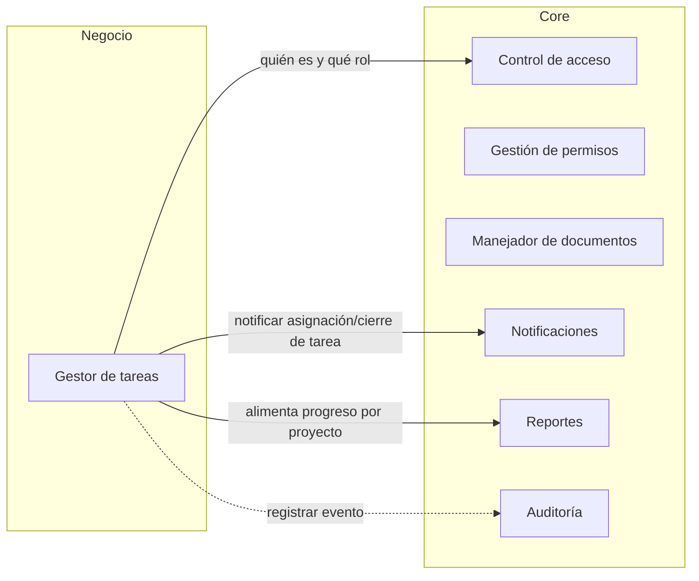
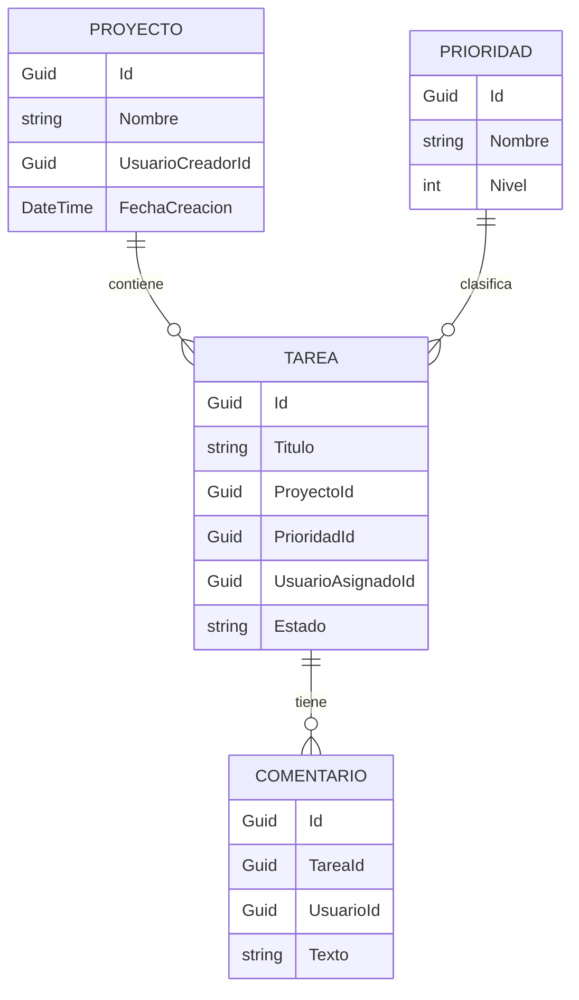

# GestorTareasP3
Gestor de tareas por proyecto: organiza las tareas por proyecto y prioridad, con vista de progreso. Proyecto de Programación III.
## Arquitectura de componentes



## Entidades del módulo de negocio



## Cómo ejecutar

### Requisitos previos
- SDK de .NET 10.
- Docker Desktop, abierto y corriendo.
- Herramienta de migraciones de Entity Framework: `dotnet tool install --global dotnet-ef` (una sola vez).
- PowerShell (los comandos de este README son para Windows PowerShell).

### 1. Variables de entorno
Copia la plantilla y completa tus valores:

```powershell
Copy-Item .env.example .env
```

Abre `.env` y define:
- `MSSQL_SA_PASSWORD`: inventa una contraseña de 8 o más caracteres con mayúscula, minúscula, número y símbolo. Evita `$`, `;`, `=`, comillas y espacios.
- `ConnectionStrings__Default`: reemplaza `CAMBIAR_ESTO` en `Database` por `GestorTareas` y en `Password` por la misma contraseña de arriba.
- `SMTP_USUARIO` y `SMTP_REMITENTE`: tu cuenta de Gmail.
- `SMTP_CLAVE`: la contraseña de aplicación de esa cuenta, sin espacios.
- `SMTP_HOST`, `SMTP_PUERTO` y `SMTP_NOMBRE_REMITENTE` ya traen un valor útil en la plantilla.

El archivo `.env` está en `.gitignore` y nunca se sube al repositorio.

| Nombre | Para qué sirve |
| --- | --- |
| `MSSQL_SA_PASSWORD` | Contraseña del usuario `sa` del SQL Server en Docker. La lee Docker Compose desde `.env`. |
| `ConnectionStrings__Default` | Cadena de conexión a la base `GestorTareas`. La usan la API y `dotnet ef`. |
| `SMTP_HOST` | Servidor SMTP. Con Gmail: `smtp.gmail.com`. |
| `SMTP_PUERTO` | Puerto SMTP con cifrado STARTTLS: `587`. |
| `SMTP_USUARIO` | Cuenta con la que el Enviador inicia sesión en el servidor SMTP. |
| `SMTP_CLAVE` | Contraseña de aplicación de esa cuenta. En Gmail se crea en `myaccount.google.com/apppasswords` y exige la verificación en dos pasos. Se escribe sin espacios. |
| `SMTP_REMITENTE` | Dirección que figura como remitente. Con Gmail, la misma cuenta de `SMTP_USUARIO`. |
| `SMTP_NOMBRE_REMITENTE` | Nombre que ve el destinatario en su bandeja, por ejemplo `Gestor de Tareas`. |

.NET no lee el archivo `.env` por sí solo. En cada ventana de PowerShell nueva, antes de aplicar migraciones o ejecutar la API, carga las variables con:

```powershell
Get-Content .env | Where-Object { $_ -match '^\s*[^#=\s]+=' } | ForEach-Object { $n, $v = $_ -split '=', 2; [Environment]::SetEnvironmentVariable($n.Trim(), $v.Trim(), 'Process') }
```

### 2. Base de datos
```powershell
docker compose up -d
```
Espera unos 30 segundos a que SQL Server termine de arrancar. Luego crea la base y la tabla:

```powershell
dotnet ef database update --project src/GestorTareas.ControlAcceso
```
Luego crea la tabla de la cola de correos:

```powershell
dotnet ef database update --project src/GestorTareas.Notificaciones
```

Para apagar la base sin perder los datos: `docker compose down`. No uses `docker compose down -v`, que borra el volumen con los datos.

### 3. Ejecutar la API
Con las variables cargadas en esta ventana:

```powershell
dotnet run --project src/GestorTareas.Api --launch-profile http
```

La API queda en `http://localhost:5065`. Verifica con `Invoke-RestMethod http://localhost:5065/salud`, que debe responder `OK`.

## Cómo probar los criterios

Abre **otra** ventana de PowerShell (la primera queda ocupada con la API) y define esta función de ayuda, que muestra el código de respuesta y el mensaje:

```powershell
$base = "http://localhost:5065"
function Probar($cuerpo) {
  try {
    $r = Invoke-WebRequest -Uri "$base/api/registro" -Method Post -ContentType "application/json" -Body $cuerpo -UseBasicParsing
    "$($r.StatusCode) $($r.Content)"
  } catch {
    $resp = $_.Exception.Response
    $texto = $_.ErrorDetails.Message
    if (-not $texto -and $resp) {
      try { $texto = (New-Object System.IO.StreamReader($resp.GetResponseStream())).ReadToEnd() } catch {}
    }
    "$([int]$resp.StatusCode) $texto"
  }
}
```

### Registro de usuario (RF-CA-01, RF-CA-02, RF-CA-14, RD-07)

| Criterio | Comando | Resultado esperado |
| --- | --- | --- |
| Registro válido | `Probar '{"nombre":"Prueba Uno","correo":"prueba1@example.com","contrasena":"Clave1234"}'` | `201` y "Cuenta creada correctamente." |
| Correo repetido (RF-CA-01) | El mismo comando de arriba otra vez | `409` y "Ya existe una cuenta con ese correo." |
| Contraseña corta (RF-CA-14) | `Probar '{"nombre":"Corta","correo":"corta@example.com","contrasena":"ab12"}'` | `400` y "La contraseña debe tener al menos 8 caracteres." |
| Contraseña sin número (RF-CA-14) | `Probar '{"nombre":"Letras","correo":"letras@example.com","contrasena":"SoloLetras"}'` | `400` y mensaje de que falta un número |
| Correo mal formado (RD-07) | `Probar '{"nombre":"Malo","correo":"esto-no-es-un-correo","contrasena":"Clave1234"}'` | `400` y "El correo no tiene un formato válido." |
| Objeto vacío (RD-07) | `Probar '{}'` | `400` con los errores de nombre, correo y contraseña obligatorios |
| JSON roto (RD-07) | `Probar '{"nombre": '` | `400` y "Los datos enviados no tienen un formato válido." |
| Tipo incorrecto (RD-07) | `Probar '{"nombre":123,"correo":"a@example.com","contrasena":"Clave1234"}'` | `400` y el mismo mensaje de formato |

Ningún mensaje contiene trazas, rutas ni consultas (RD-08).

### Hash con sal (RF-CA-02)
Registra un segundo usuario con la misma contraseña:

```powershell
Probar '{"nombre":"Prueba Dos","correo":"prueba2@example.com","contrasena":"Clave1234"}'
```

Conéctate con SSMS a `localhost,1433` (autenticación SQL Server, usuario `sa`, tu contraseña, marcando "Trust server certificate") y ejecuta:

```sql
USE GestorTareas;
SELECT Nombre, Correo, HashContrasena, Sal, Rol, Activo FROM Usuarios;
```

Resultado esperado: la contraseña no aparece en ninguna columna, `HashContrasena` y `Sal` son distintos para cada usuario aunque la contraseña sea la misma, y `Activo` vale `0` (la cuenta nace inactiva).

### Persistencia (RD-09)
Detén la API con Ctrl+C, vuelve a arrancarla y repite la consulta de SSMS: los usuarios siguen ahí.

## Correo saliente: la cola y el Enviador

Ninguna operación envía correos por sí misma. Cada correo se anota en la tabla `CorreosEnCola` con estado pendiente, y un programa aparte, el Enviador, toma los pendientes, los envía por SMTP y los marca como enviados. Así una operación termina bien aunque el servidor de correo no responda.

Carga las variables en la ventana de PowerShell (comando de «Variables de entorno») y ejecuta:

```powershell
dotnet run --project src/GestorTareas.Enviador
```

Imprime `Resumen: enviados N; fallidos M.` Si el correo no aparece en la bandeja, revisa la carpeta de spam.

### Cómo probar los criterios

Por ahora la cola se alimenta a mano. Abre SSMS en `localhost,1433`, **New Query**, reemplaza el destinatario por tu correo y ejecuta:

```sql
USE GestorTareas;
INSERT INTO CorreosEnCola (Id, Destinatario, Asunto, Cuerpo, Estado, Intentos, FechaCreacion)
VALUES (NEWID(), 'TU_CORREO_AQUI', 'Prueba del Enviador', 'Hola, este es un correo de prueba.', 0, 0, SYSUTCDATETIME());
```

| Criterio | Cómo provocarlo | Resultado esperado |
| --- | --- | --- |
| El correo se envía de verdad (RF-NOT-09) | Ejecuta el Enviador | `enviados 1; fallidos 0.` y el correo llega, con remitente «Gestor de Tareas» |
| No duplica envíos (RF-NOT-12) | Ejecuta el Enviador otra vez | `enviados 0; fallidos 0.` y no llega nada |
| La operación no depende del servidor SMTP (RF-NOT-08) | Inserta otro correo, ejecuta `$env:SMTP_HOST = "servidor.invalido"` y corre el Enviador | `fallidos 1`. En SSMS, `SELECT Estado, Intentos, UltimoError FROM CorreosEnCola` muestra el correo con `Estado = 0` (pendiente) e `Intentos = 1` |
| El correo pendiente se entrega después | Restaura con `$env:SMTP_HOST = "smtp.gmail.com"` y vuelve a correr el Enviador | `enviados 1` y el correo llega |
| Sin credenciales en el repositorio (RF-NOT-13) | Quita `SMTP_CLAVE` del entorno y corre el Enviador | Mensaje con el nombre de la variable que falta, sin datos sensibles |