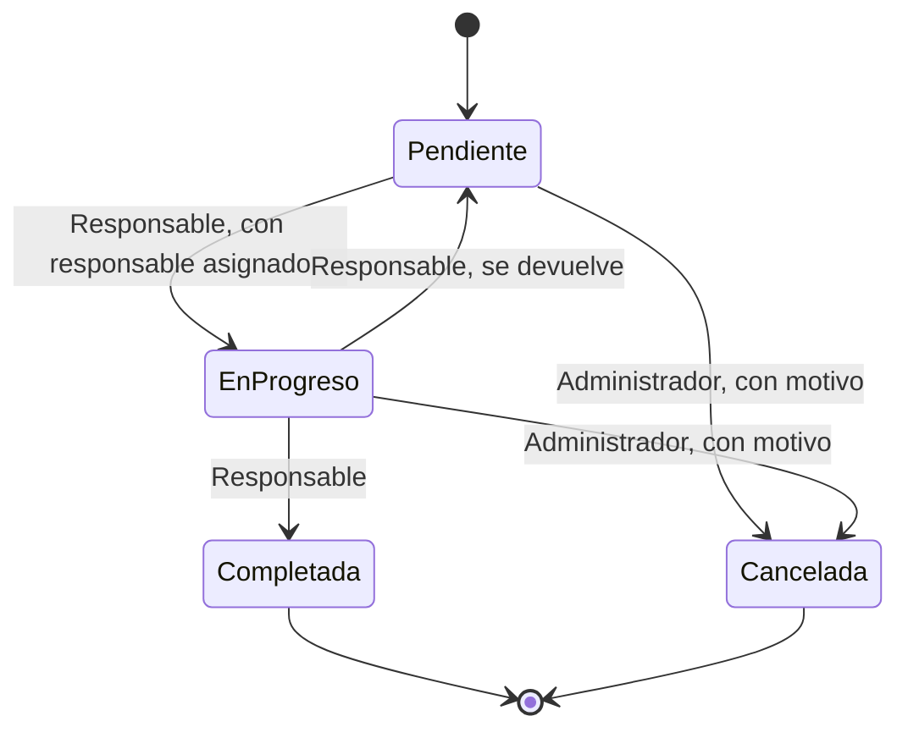

# Máquina de estados de Tarea

La entidad central del módulo de negocio es `Tarea`. Su estado sigue esta máquina, independiente de la de Gestión de permisos del Core (RF-NEG-09).

## Estados

Declarados en un solo lugar: `src/GestorTareas.Negocio/Entidades/EstadoTarea.cs` (RF-NEG-03).

| Estado | Significado | ¿Terminal? |
|---|---|---|
| Pendiente | La tarea existe y todavía no se empieza. Es el estado inicial. | No |
| EnProgreso | El responsable está trabajando en la tarea. | No |
| Completada | La tarea se terminó. | **Sí** |
| Cancelada | La tarea se descartó, con un motivo escrito. | **Sí** |

## Transiciones

Declaradas en un solo lugar: `src/GestorTareas.Negocio/Estados/MaquinaEstadosTarea.cs` (RD-04). La única forma de cambiar el estado es `Tarea.CambiarEstado`. Un rechazo devuelve un mensaje y el estado no cambia.

| Desde | Hacia | Quién la ejecuta | Condición |
|---|---|---|---|
| Pendiente | EnProgreso | Responsable | La tarea tiene responsable asignado. |
| EnProgreso | Completada | Responsable | — |
| EnProgreso | Pendiente | Responsable | Se devuelve sin terminar. |
| Pendiente | Cancelada | Administrador | Exige un motivo escrito. |
| EnProgreso | Cancelada | Administrador | Exige un motivo escrito. |
| Pendiente | Completada | — | **Prohibida de forma explícita** (RF-NEG-04): una tarea no se puede completar sin haberse empezado. |
| Completada o Cancelada | Cualquiera | — | **Prohibida**: son estados terminales (RF-NEG-05). |
| Cualquier otra combinación | — | — | **Prohibida.** El sistema la rechaza y el estado no cambia. |

## Diagrama

## Orden en que se validan las reglas

1. Si el estado actual es terminal, se rechaza.
2. Si la transición está en la lista de prohibidas, se rechaza con su motivo.
3. Si no está en la lista de permitidas, se rechaza.
4. Si quien la ejecuta no es el actor de esa transición, se rechaza.
5. `Pendiente → EnProgreso` sin responsable asignado se rechaza.
6. Una cancelación sin motivo se rechaza.

## Alcance actual

En la Práctica 1 se entrega la estructura. Las pruebas de esta máquina llegan en la semana 8, y los endpoints que la usan llegan con el módulo de negocio.